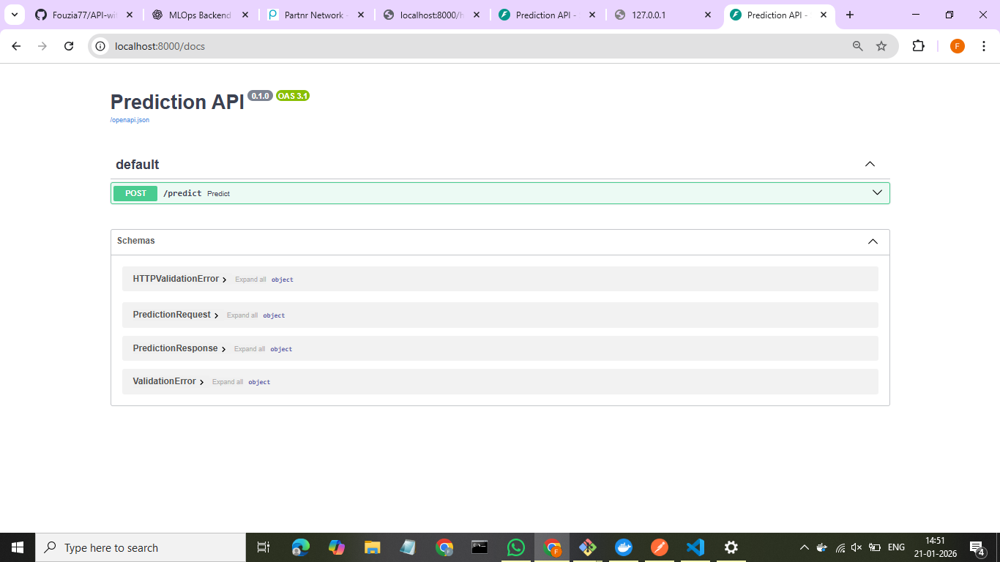
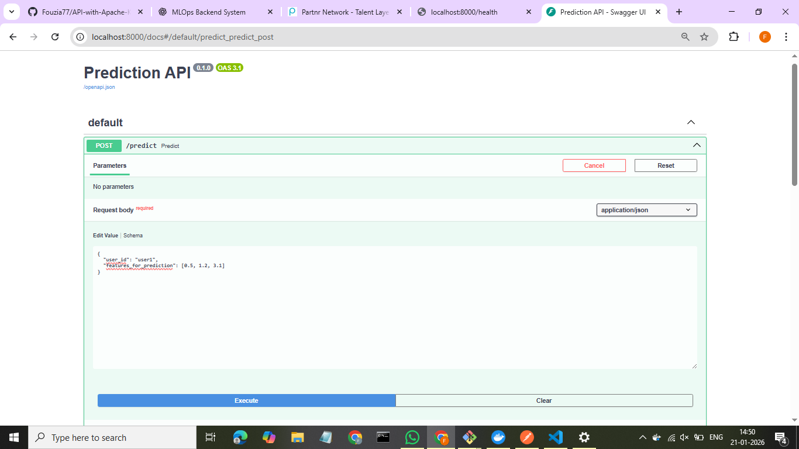

# Kafka-Prediction-API Project

## Overview

This project is a real-time feature ingestion and prediction system using **Kafka**, **PostgreSQL**, and a **Machine Learning Prediction API**.

**Flow:**

1. Messages are produced to a Kafka topic `raw_data_events`.
2. A Kafka consumer reads messages and stores features in PostgreSQL (`user_features` table).
3. The Prediction API uses a pre-trained ML model (`model.pkl`) to make predictions based on user features.

---

## Architecture

**Components:**

* **Kafka**: Message broker to stream feature data.
* **Kafka Consumer**: Consumes messages, validates them, and stores features in PostgreSQL.
* **PostgreSQL**: Stores user features.
* **Prediction API**: Provides prediction results using a pre-trained model.
* **Kafka REST Proxy**: Optional REST interface to produce messages to Kafka.

---

## Prerequisites

* Docker and Docker Compose
* Python 3.10+ (for local ML model creation)
* pip (Python packages: `scikit-learn`, `numpy`, `psycopg2-binary`)

---

## Project Setup

1. **Clone the repository**

```bash
git clone <https://github.com/Fouzia77/API-with-Apache-Kafka.git>
cd API-with-Apache-Kafka
```

2. **Create the ML model (optional if `model.pkl` exists)**

```bash
cd prediction-api-service
python create_model.py
```

3. **Build and start Docker services**

```bash
docker-compose up --build -d
```

4. **Verify services are running**

```bash
docker ps
```

You should see:

* Kafka
* Zookeeper
* Postgres
* Kafka Consumer
* Prediction API
* Kafka REST Proxy

---

## Environment Variables

Defined in `docker-compose.yml`:

**Kafka Consumer**

* `KAFKA_BOOTSTRAP_SERVERS=kafka:9092`
* `KAFKA_TOPIC=raw_data_events`
* `POSTGRES_HOST=postgres`
* `POSTGRES_DB=feature_store_db`
* `POSTGRES_USER=postgres`
* `POSTGRES_PASSWORD=fouzia`

**Prediction API**

* `MODEL_PATH=/app/model.pkl`
* `MODEL_VERSION=1.0.0`

---

## Database Setup

* The Kafka consumer automatically initializes the `user_features` table in PostgreSQL.

```sql
\dt
```

* You should see:

```
public | user_features | table | postgres
```

---

## Producing Messages

**Option 1: Using Kafka REST Proxy**

Request : POST http://localhost:8082/topics/raw_data_events \
  -Header  "Content-Type: application/vnd.kafka.json.v2+json" \
  JSON Body: 
    {
  "records": [
    {
      "value": {
        "user_id": "user2",
        "event_type": "prediction_input",
        "value": 45,
        "timestamp": "2026-01-20T15:00:00Z"
      }
    }
  ]
}

Response:
    {
    "offsets": [
        {
            "partition": 0,
            "offset": 3,
            "error_code": null,
            "error": null
        }
    ],
    "key_schema_id": null,
    "value_schema_id": null
}

**Option 2: Using Postman**

* POST request to `http://localhost:8000/predict`
* JSON Body:


{
  "user_id": "user1",
  "features_for_prediction": [0.5, 0.7, 0.3]
}

Response : 

{
    "user_id": "user1",
    "prediction_score": 0.610410848798892,
    "model_version": "1.0.0"
}

## Testing

### 1. API Docs

* Visit `http://localhost:8000/docs` to test endpoints interactively.

### 2. Produce and Consume

* Send a message via REST Proxy or Postman.
* Verify Kafka consumer logs:

bash
docker logs -f apiwithapachekafka-kafka-consumer-service-1

* Check PostgreSQL table:

```sql
SELECT * FROM user_features;
```
Response :
feature_store_db=# SELECT * FROM user_features;
              feature_id              | user_id |    event_type    | feature_value |  ingestion_timestamp
--------------------------------------+---------+------------------+---------------+------------------------
 219067be-0a44-44a8-9d71-b0590eff0422 | user1   | click            |           1.5 | 2026-01-20 15:00:00+00
 5c06da81-8976-415b-bf64-f28057170a98 | user2   | prediction_input |            45 | 2026-01-20 15:00:00+00
(2 rows)


### 3. Prediction API

* Send POST request to `/predict` with user features.
* Expected response:

```json
{
  "user_id": "user1",
  "prediction_score": 0.61,
  "model_version": "1.0.0"
}
```

---
localhost:8000/docs



## Common Errors & Fixes

| Error                               | Cause                                              | Solution                                                         |
| ----------------------------------- | -------------------------------------------------- | ---------------------------------------------------------------- |
| `Model not loaded`                  | Model file missing or path incorrect               | Ensure `model.pkl` exists and `MODEL_PATH` is correct            |
| `Invalid message format`            | JSON payload missing required fields               | Include `user_id` and `features_for_prediction` in POST body     |
| `HTTP 415 Unsupported Media Type`   | Incorrect Content-Type header                      | Use `application/json` in POST requests                          |
| Kafka Consumer offset commit errors | Processing took longer than `max_poll_interval_ms` | Reduce batch size or increase `max_poll_interval_ms` in consumer |

---

## Stopping Services

```bash
docker-compose down
```

---

## Notes

* Ensure Python dependencies match the versions used in the Docker containers.
* Always produce messages with correct feature names and count (`features_for_prediction`) for successful ingestion.

---


